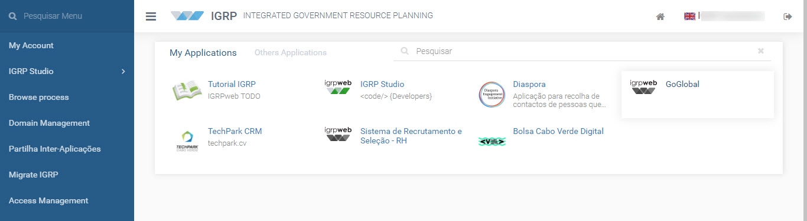
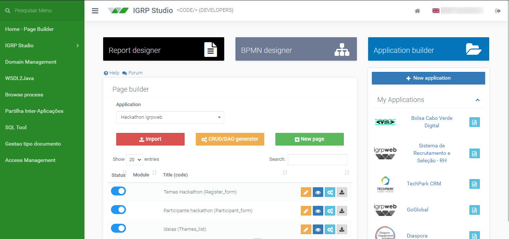

Homepage: www.igrp.cv

igrp**web** is a integrated platform created and developed by NOSi targeted at e-Govermment people, developers ans system admins. The igrp**web** core is extremely lightweight and based on simple concepts. 
It's open-source and distributed under the Apache license. Runs in java web application, on a server, on a cluster or in the cloud.

The development process is empowered by IGRP-Studio combining Aplication Builder, Business Process Management (BMN), Report Builder, Java Code Editor. 

## igrpweb Demo

Demo cloud https://cloud.nosi.cv/IGRP:
- User: demo@nosi.cv
- Pass: demo

## Developer Guide

The manual for developer is available online, and embeded in the framework as Help link. 
[Docs IGRP (PT)](https://docs.igrp.cv)

## FAQ How to...

### Can i do local development with igrp**web**?

- For local development you'll need Eclipse or Netbeans installed and tomcat. 
- Follow the instruction for local instalation on eclipe <a href="https://www.youtube.com/watch?v=-Verby5QJ14&t=31s" target="_blank"> Here</a>

